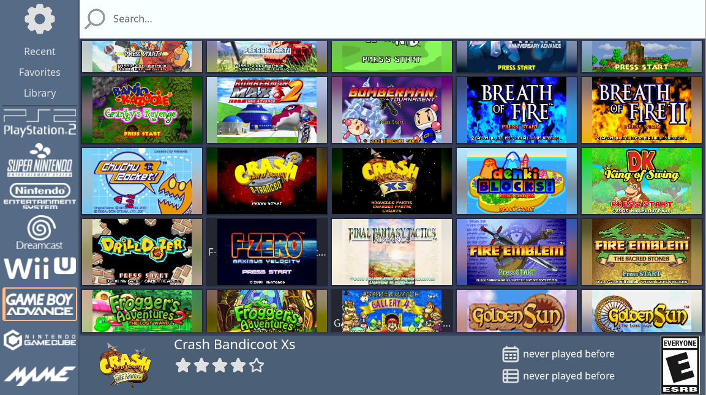
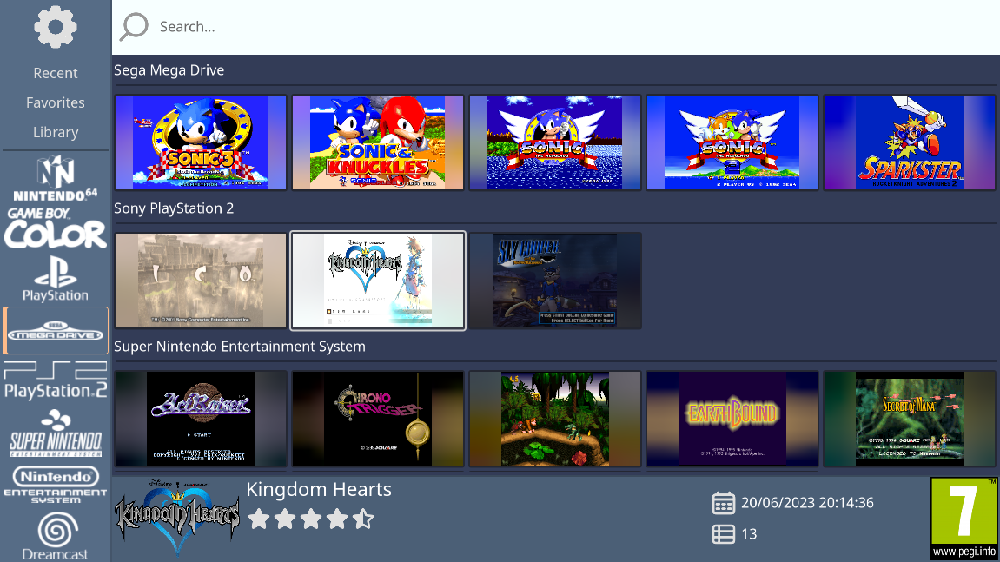
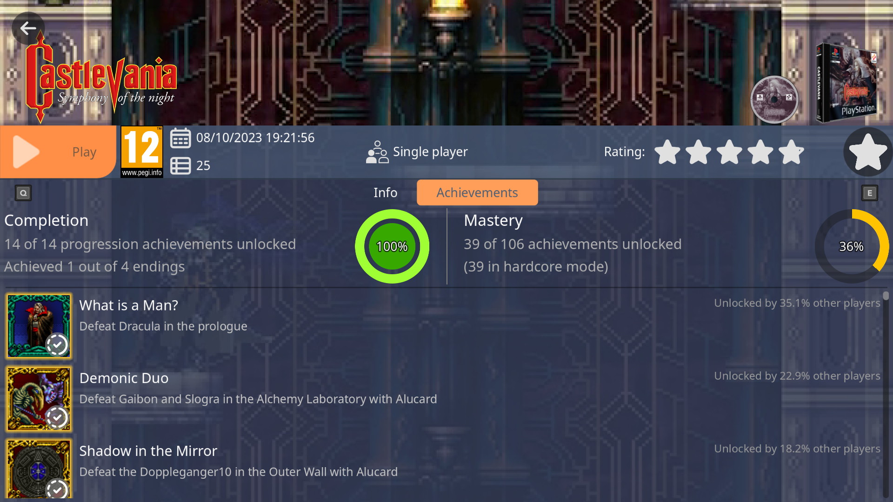

# `default` - Default theme for RetroHub

## Installation

> This theme is shipped by default with RetroHub, so there's no need to download manually unless you wish to try newer versions.

- Download the latest release
- Drop in RetroHub's `themes` path
- Select it from settings

## System Support

This theme is designed to support all systems.

## Input Type

This theme support both keyboard/mouse and controller input types.

## Credits

This theme uses icons from [Godot Engine](https://github.com/godotengine/godot/).